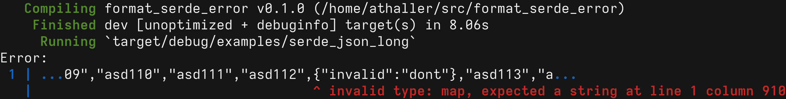
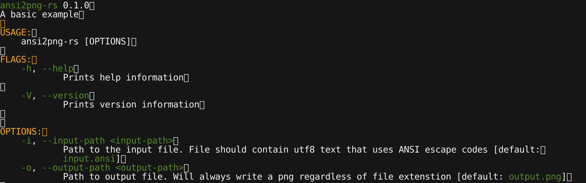
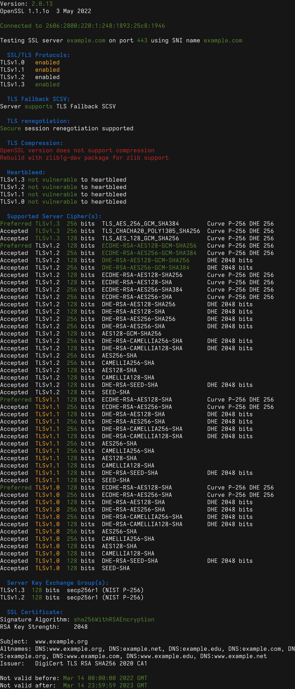
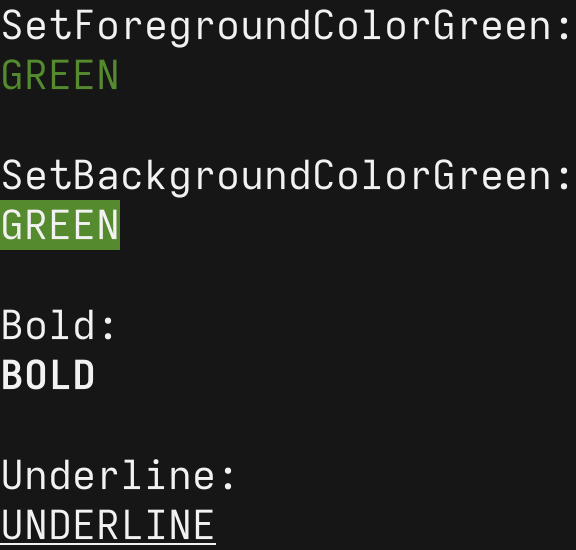

# ansi2png-rs

Read ansi sequences from a file and generate a png from it.

```
ansi2png-rs --input-path input.ansi --output-path output.png
```

## Examples

Generated from [resources/out.ansi](resources/out.ansi):


Generated from [resources/ansi2png_help.ansi](resources/ansi2png_help.ansi):


Generated from [resources/sslscan.ansi](resources/sslscan.ansi):


Generated from [resources/tests.ansi](resources/tests.ansi):

